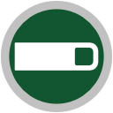
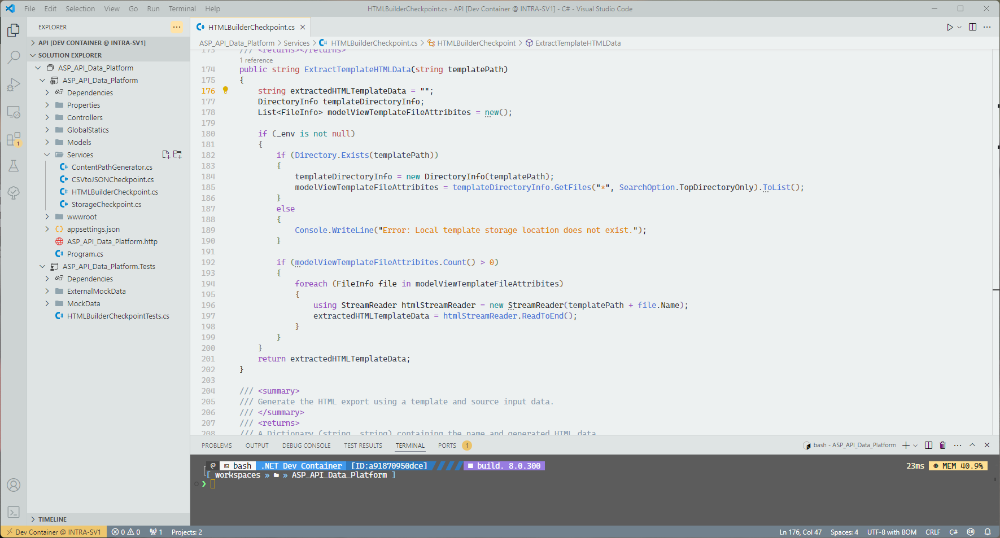
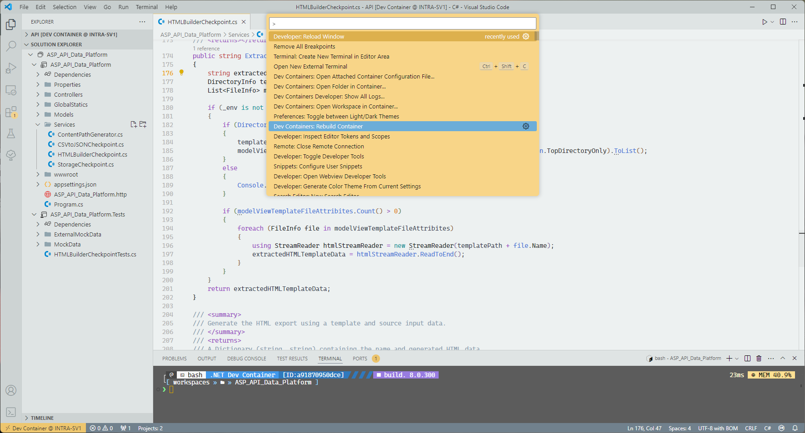

## 
 

## 
 **Acheron Standard**

-----

A 'neo-retro' utilitarian theme with a focus on legibility and minimal distraction. Pallete derived from sci-fi spacecraft interiors - Alien, Star Wars, 2001.

-----

# ◢◤◢◤◢◤◢◤◢◤ ══════════

# ◢◤◢◤◢◤◢◤◢◤ ══════════

# ◢◤◢◤◢◤◢◤◢◤ ══════════

## ⚠ **You can override this theme!**

Don't like the colour of the status bar? No worries!

It's easy to adjust almost any of the pallete colours set out in this theme. To override them, you can use your personal config file. Here's a guide to get you  🡆 **[started](https://code.visualstudio.com/api/extension-guides/color-theme)**.

### **Wondering what the logo is?**

It's the coffee icon from the [**Semiotic Standard Symbols Set**](https://alienanthology.fandom.com/wiki/Semiotic_Standard) designed by Ron Cobb for Alien (1979).

### **Have a suggestion?**

File an issue or post to the Q&A if you have any questions or suggestions. The token colours have been altered for C++ and a few other primary languages I personally use. Let me know if you'd like the colours adjusted for your favourite language and I'll push an update through.

